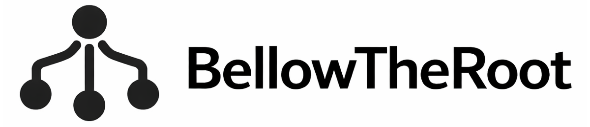

<h1 align="center">
  
  <br>
</h1>

A web application for subdomain enumeration that orchestrates multiple security tools to discover subdomains for target domains.

## Overview

BellowTheRoot is a Flask-based web application that manages subdomain enumeration scans using various security tools. It provides a web interface to organize projects, run scans, and view results in real-time.

## Quick Start

1. Install dependencies: `pip install -r requirements.txt`
2. Rename `.env.example` file to `.env` and add your credentials 
2. Set up PostgreSQL database with `python3 setup_database.py`
4. Run: `python app.py`
5. Access: `http://localhost:5000`


## Creating Tools and Pipelines

Tools are configured in `config/tools.yaml`. You can add new tools by editing this file or using the web interface.

### Creating a CLI Tool

A CLI tool runs a command-line executable. Example:

```yaml
tools:
  mytool:
    enabled: true
    type: cli
    description: "My custom subdomain tool"
    command: mytool
    args:
      - -d {domain}
      - -silent
    output: lines  # or 'csv' for CSV file output
    path_setting: tool_mytool_path  # Optional: custom path setting
```

**Key fields:**
- `command`: The executable command (must be in PATH or use full path)
- `args`: List of arguments (use `{domain}` placeholder for target domain)
- `output`: `lines` for line-by-line text, or `csv` for CSV files
- Use placeholders: `{domain}`, `{wordlist_name}`, `{input_file_name}`

### Creating an API Tool

An API tool makes HTTP requests to external APIs. Example:

```yaml
tools:
  myapi:
    enabled: true
    type: api
    description: "My API subdomain service"
    method: GET
    url: https://api.example.com/subdomains/{domain}
    headers:
      Authorization: Bearer {api_key}
    api_key_setting: tool_myapi_api_key  # Database setting key for API key
    timeout: 30
    response_type: json
    extract:
      type: json_path
      path: data.subdomains  # JSONPath to extract subdomains
```

**Key fields:**
- `url`: API endpoint (use `{domain}` and `{api_key}` placeholders)
- `extract`: Configuration for extracting subdomains from response
  - `type: json_path` - Navigate JSON structure
  - `type: array` - Extract from array of objects
  - `type: url_extract` - Extract domains from URLs using regex

### Creating a Pipeline

A pipeline chains multiple tools together, with output from one tool piped to the next. Example:

```yaml
tools:
  mypipeline:
    enabled: true
    type: pipeline
    description: "Subdomain permutation and resolution"
    run_after: passive  # Run after individual tools complete
    input: scan_subdomains  # Use discovered subdomains as input
    steps:
      - name: permute
        command: alterx
        args:
          - -l {input_file}  # {input_file} is auto-created from scan_subdomains
          - -silent
      - name: resolve
        command: dnsx
        args:
          - -silent
        pipe_from: permute  # Pipe output from 'permute' step
```

**Key fields:**
- `run_after: passive` - Pipeline runs after all individual tools complete
- `input: scan_subdomains` - Uses all discovered subdomains as input (creates temp file)
- `steps`: List of commands to run in sequence
- `pipe_from`: Pipe output from a previous step to this step's stdin

**Placeholders in pipelines:**
- `{input_file}` - Temporary file with all discovered subdomains (when `input: scan_subdomains`)
- `{input_file_name}` - Custom input file from Settings
- `{domain}` - Target domain


